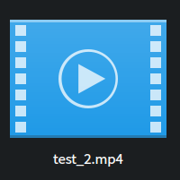

# Day 12: No zero days November

**It's alive!!** I have not kept it much of a secret that I've been struggling a lot with the whole ffmpeg stuff. Almost completely gave up on it today tbh. But I finally managed to get it somewhat working!!

## What works?

Right now we got a function which will return some debug data, not really interesting for most people, but it helps me to figure out some of the problems which are happening. Debugging a GDExtension is not really easy and ffmpeg tends to crash the Godot editor at this moment. I feel that I got the video encoding part mostly working now. The main struggle is still getting the video and audio streams out of a video file though.

## Next up

I'll continue to work on ffmpeg, which will probably take more than the rest of the month. I'm really not going to go too much into optimizing anything at all for the time being. Main focus is like I said before, make it work. Kind of glad that my migraine isn't that bad anymore today and with a couple of rests every now and then I managed to make some progress, most progress is more in terms of understanding ffmpeg and only a little progress is code based, progress is progress.

## Conclusion

The github roadmap for GoZen is getting outdated quite quickly tbh hahah. I really wish ffmpeg wasn't such a pain to work with in the first place, second place for being a pain to work with is figuring out gdextensions. Still, I'm happy I went with a gdextension as this is a part of the Godot engine I really want to understand better as I think it can yield good benefits. Anyway, this was another small update, only 4 o'clock so I'll probably get a bit more work done.

## Attachment

This may not look like much, but this was completely added by the gdextension with the ffmpeg library
