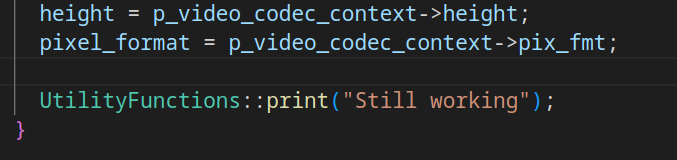

# Day 19: No zero days November

I have been quite busy since the beginning of this month, we are over the halfway mark of No zero days November and today was the first day that I thought I may not be able to get any work done on GoZen. Do I need a break, is it because I accidentaly woke up at 3 o'clock, is my mind too tired of ffmpeg/learning stuff, is it because of the bad weather, has my kid stolen all my energy again? No idea what the cause is of my lack of motivation today, but I know it's only temporary and the main cause can be because it has been terrible weather the past couple of days.

## Today's report

Worked more on the demuxer and the decoder as I can't quite figure out how to get it working to put the data into Godot. Will probably take a bit longer to figure this part out, once the importer is fully working I'll be making the next update video. Some problems I am facing is very irregular crashes, removed a VERY large part of the code and started over again as I could not make sense of why it was crashing and what exactly I forgot.

### What the whole GoZen project can teach you

The main point which people can learn from my journey with GoZen is: Think carefully when starting a project when your initial thoughts are 'I can make a better program compared to this.' That being said, I truely enjoy this journey and have no regrets of having started a giant undertaking of making my own video editor. Is it taking longer then I initially planned? Not really, actually going faster than initialy planned. I thought it would be a lot more work, that is not to say that it is not a lot of work! It's just a lot of learning and bug fixing. Honestly, if GDExtensions would be easier to debug, I could have probably finished the ffmpeg stuff by now and have gotten back to the UI side of things.

## You guys give me motivation

As I said in the beginning of this post, it was quite difficult to get started today. Busy morning with housekeeping, spending time with my kid, cleaning, cooking, ... I woke up at 3 o'clock this morning because of the bad weather, this may also be the biggest cause for not feeling productive or in the mood to do much today. My main motivation today to actually get work done was by thinking of all the support I have received so far, both on youtube with the likes and the comments, here on Discord, and the people who have donated so far on ko-fi. Not certain if I would have gotten this far without. I'm not the kind of person who easily gives up, even when I dream I am thinking of how to fix bugs or code stuff, I go to bed with a notebook so I don't wake up in the middle of the night to test out what I saw in my dream of how to implement a feature or fix a bug!

I'll probably feel more motivated to work after a good night rest, it's nearly 4 o'clock, I managed to get 2.5 hours of work on GoZen done, kind of feel like I keep hitting a stop sign so I'll call it for today and unwind so I can head to bed early today. ^^

## Quick note

On a quick note, look at this image. Am I the only one who debugs like that? hahah That one line has travelled with me since I started on the ffmpeg stuff.

## An hour later...

Demuxer + decoder is ready. Not certain why, but after writing the long for today, I took a nap and came up with why it's probably not working ... and somehow it works now. ^^" Still need to find a way to write the actual data to Godot. But we will soon be able to import video files into GoZen (Video together with it's audio :D)
