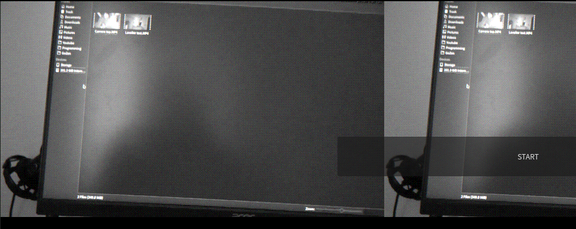

# Day 22: No zero days November

Very frustrating day today, I really wanted to get the audio importing done, however something goes wrong and the end result is just a noisy mess, but you can slightly hear what is being said in the video ... so yey progress?

## Audio

I don't know enough about audio to know what's going wrong here. A quick and dirty solution would just be to separate audio from video and save the audio as an actuall file in a 'cache folder'. This will make the cache folder quite large in size, but would be the quickest way to get audio working.

## Video

As I was hitting my head violently against a wall, I realized that video frames are easier as I know how they work ... Except that it is in a planer format .... not in a pixel format.

### SWS to the rescue!!

But I remembered that I used swscale to convert rgba8 to yuv420p for the rendering system! Yey problem solv..... yeah nope, it still returns the bytes in yuv420p for some reason. :/ Probably an argument that I pass wrongly, but I can't seem to figure this stuff out.

## My programming skills

I have a good amount of programming experience under my belt, but I will also be the first one to say that my programming skills are still quite bad. Point proven with GoZen I guess. Today was especially frustrating because I know that people expect my to make GoZen into a success and I really am trying my best. Had a ton of hours in the ffmpeg codec documentation, reading/watching info about codecs, refreshing my C++ which has never been very great to begin with (occasionally made a basic game engine, that's about it).

At this point I am not certain what's causing all the issues I've been facing. Lots of the things I need to do is working with bytes and vectors inside of C++, but I feel that the Godot API to work with C++ stuff is kind of limiting as I can not create PackedByteArrays by using a constructor with a vector.

## But wait!

So yeah, we don't have a fully working audio import, and we also don't have a fully working video import ... But I did manage to get the audio to be a little bit audable of what's being said in it, and here you have the first screenshot of an image from a video being displayed inside of Godot! 😄

The image is not in color, and for some reason the sizing is a bit all over the place, but it's kind of working ... I guess hahaha
